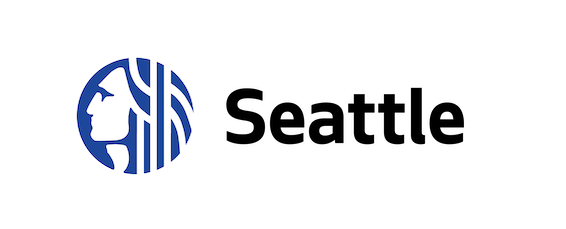

# ANTICIPEZ LES BESOINS EN CONSOMMATION DES BATIMENTS

## Troisième projet de ma formation de Data Scientist

## Contexte

  

Vous travaillez pour la ville de Seattle. Pour atteindre son objectif de ville neutre en émissions de carbone en 2050, votre équipe s’intéresse de près à la consommation et aux émissions des bâtiments non destinés à l’habitation.

Des relevés minutieux ont été effectués par les agents de la ville en 2016. Cependant, ces relevés sont coûteux à obtenir, et à partir de ceux déjà réalisés, vous voulez tenter de prédire les émissions de CO2 et la consommation totale d’énergie de bâtiments non destinés à l’habitation pour lesquels elles n’ont pas encore été mesurées.

Vous cherchez également à évaluer l’intérêt de l’"ENERGY STAR Score" pour la prédiction d’émissions, qui est fastidieux à calculer avec l’approche utilisée actuellement par votre équipe. Vous l'intégrerez dans la modélisation et jugerez de son intérêt.

## Préambule
Ce projet a été réalisé en langage Python dans des notebooks Jupyter.

## Les données
Les données et leurs sources sont respectivement disponibles aux adresses suivantes https://s3.eu-west-1.amazonaws.com/course.oc-static.com/projects/Data_Scientist_P4/2016_Building_Energy_Benchmarking.csv et https://data.seattle.gov/dataset/2016-Building-Energy-Benchmarking/2bpz-gwpy.

Le calcul de l'ENERGY STAR Score est disponible à l'adresse suivante: https://www.energystar.gov/buildings/facility-owners-and-managers/existing-buildings/use-portfolio-manager/interpret-your-results/what.

## Missions
1. Réalisation du nettoyage des données et d'une analyse exploratoire des données nettoyées.
2. Test de différents modèles de prédiction afin de répondre au mieux à la problématique.

## Contenu du dépôt
1. Le notebook de nettoyage des données et l'analyse exploratoire des données nettoyées: notebook_exploratoire_1.ipynb.
2. Le notebook de prédiction pour la consommation en énergie: notebook_prediction_energie_2.ipynb.
3. Le notebook de prédiction pour l'émission des gaz à effet de serre: notebook_prediction_emmissions_3.ipynb.
4. Le support de présentation pour la soutenance: support_presentation_4.pdf.
5. Le librairies nécessaires à la réalisation du projet: requirements.txt.
6. Le logo de la ville de Seattle: logo_seattle.png.

## Compétences acquises
1. "Feature engineering" *via* la création/transformation de certaines variables.
2. Mise en place d'un modèle d'apprentissage supervisé adapté à la problématique métier.
3. Evaluation des performances du modèle grâce aux métriques adéquates.
4. Optimisation du modèle par la recherche d'hyperparamètres *via* GridSearchCV.
5. Détermination des "feature importances" et des valeurs de SHAPLEY.

## Auteur
**colple** *(Coline Plé)*

